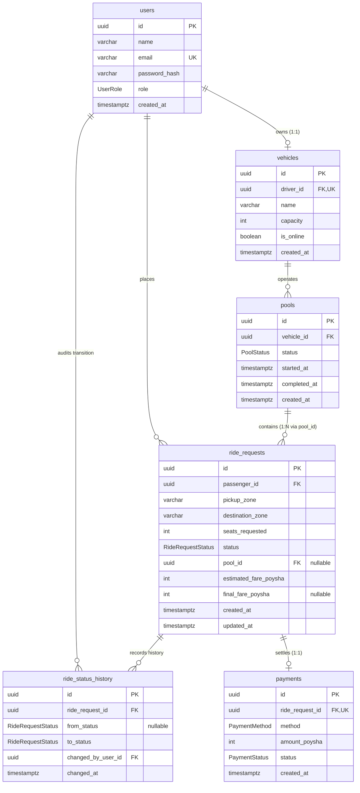

# TinChaka Architecture & Data Model Specification

> **Document Version:** 1.0.0  
> **Status:** Draft for Review (Step 2 Deliverable per `PROJECT_PLAN.md §19`)  
> **Authoritative Baseline:** `docs/PRD.md` and `docs/PROJECT_PLAN.md`  

---

## SECTION 1 — SCHEMA SPEC

Database Engine: **PostgreSQL 15+**  
ORM: **Prisma**

---

### 1.1 Custom PostgreSQL Enums

```sql
CREATE TYPE "UserRole" AS ENUM (
  'PASSENGER',
  'DRIVER'
);

CREATE TYPE "RideRequestStatus" AS ENUM (
  'REQUESTED',
  'MATCHED',
  'DRIVER_ARRIVED',
  'STARTED',
  'COMPLETED',
  'CANCELLED'
);

CREATE TYPE "PoolStatus" AS ENUM (
  'MATCHED',
  'DRIVER_ARRIVED',
  'STARTED',
  'COMPLETED',
  'CANCELLED'
);

CREATE TYPE "PaymentMethod" AS ENUM (
  'CASH',
  'TESLAPAY_WALLET'
);

CREATE TYPE "PaymentStatus" AS ENUM (
  'PENDING',
  'COMPLETED',
  'FAILED'
);
```

---

### 1.2 Table Definitions

#### Table: `users`
Core identity table representing all system actors (passengers and drivers).

| Column Name | PostgreSQL Type | Nullable | Default | Constraints & Description |
|---|---|---|---|---|
| `id` | `UUID` | No | `gen_random_uuid()` | Primary Key |
| `name` | `VARCHAR(100)` | No | None | Display name (e.g., "Nusrat", "Jashim") |
| `email` | `VARCHAR(255)` | No | None | Unique login identifier |
| `password_hash` | `VARCHAR(255)` | No | None | Bcrypt hashed secret |
| `role` | `"UserRole"` | No | None | Role discriminator (`PASSENGER` or `DRIVER`) |
| `created_at` | `TIMESTAMPTZ` | No | `now()` | Account creation timestamp |

- **Foreign Keys**: None.
- **Indexes**:
  - `users_email_key` (UNIQUE on `email`).

---

#### Table: `vehicles`
Represents the three-wheeled electric vehicle operated by a driver. Bullet has a fixed capacity of 3 seats.

| Column Name | PostgreSQL Type | Nullable | Default | Constraints & Description |
|---|---|---|---|---|
| `id` | `UUID` | No | `gen_random_uuid()` | Primary Key |
| `driver_id` | `UUID` | No | None | FK to `users.id`, Unique (1 vehicle per driver) |
| `name` | `VARCHAR(100)` | No | None | Vehicle name (e.g., "Bullet") |
| `capacity` | `INTEGER` | No | `3` | Check constraint: `capacity > 0` |
| `is_online` | `BOOLEAN` | No | `false` | Driver active/available toggle |
| `created_at` | `TIMESTAMPTZ` | No | `now()` | Registration timestamp |

- **Foreign Keys**:
  - `driver_id` REFERENCES `users(id)` ON DELETE RESTRICT ON UPDATE CASCADE.
- **Constraints**:
  - `vehicles_driver_id_key` (UNIQUE on `driver_id`).
  - `check_vehicles_capacity_positive` CHECK (`capacity > 0`).
- **Indexes**:
  - `idx_vehicles_is_online` ON (`is_online`).

---

#### Table: `pools`
The operational aggregate binding a vehicle and its active trip lifecycle.

| Column Name | PostgreSQL Type | Nullable | Default | Constraints & Description |
|---|---|---|---|---|
| `id` | `UUID` | No | `gen_random_uuid()` | Primary Key |
| `vehicle_id` | `UUID` | No | None | FK to `vehicles.id` |
| `status` | `"PoolStatus"` | No | `'MATCHED'` | Pool lifecycle state |
| `started_at` | `TIMESTAMPTZ` | Yes | `NULL` | Timestamp when trip started |
| `completed_at` | `TIMESTAMPTZ` | Yes | `NULL` | Timestamp when trip completed |
| `created_at` | `TIMESTAMPTZ` | No | `now()` | Pool creation timestamp |

- **Foreign Keys**:
  - `vehicle_id` REFERENCES `vehicles(id)` ON DELETE RESTRICT ON UPDATE CASCADE.
- **Indexes**:
  - `idx_pools_vehicle_id` ON (`vehicle_id`).
  - `idx_pools_status` ON (`status`).

---

#### Table: `ride_requests`
Point-to-point ride bookings placed by passengers. Carries the pool link (`pool_id`) directly, eliminating any join/membership table per `PROJECT_PLAN.md §1`.

| Column Name | PostgreSQL Type | Nullable | Default | Constraints & Description |
|---|---|---|---|---|
| `id` | `UUID` | No | `gen_random_uuid()` | Primary Key |
| `passenger_id` | `UUID` | No | None | FK to `users.id` |
| `pickup_zone` | `VARCHAR(100)` | No | None | Starting zone (e.g., "Banani") |
| `destination_zone` | `VARCHAR(100)` | No | None | Destination zone (e.g., "Mohakhali") |
| `seats_requested` | `INTEGER` | No | `1` | Check constraint: `seats_requested > 0` |
| `status` | `"RideRequestStatus"`| No | `'REQUESTED'` | Member ride lifecycle status |
| `pool_id` | `UUID` | Yes | `NULL` | FK to `pools.id` (set when pooled) |
| `estimated_fare_poysha`| `INTEGER` | No | None | Initial solo estimate in integer poysha |
| `final_fare_poysha` | `INTEGER` | Yes | `NULL` | Final matched fare in integer poysha |
| `created_at` | `TIMESTAMPTZ` | No | `now()` | Request creation timestamp |
| `updated_at` | `TIMESTAMPTZ` | No | `now()` | Record update timestamp |

- **Foreign Keys**:
  - `passenger_id` REFERENCES `users(id)` ON DELETE RESTRICT ON UPDATE CASCADE.
  - `pool_id` REFERENCES `pools(id)` ON DELETE SET NULL ON UPDATE CASCADE.
- **Constraints**:
  - `check_ride_requests_seats_positive` CHECK (`seats_requested > 0`).
- **Indexes**:
  - `idx_ride_requests_status` ON (`status`).
  - `idx_ride_requests_pickup_zone` ON (`pickup_zone`).
  - `idx_ride_requests_pool_id` ON (`pool_id`).
  - `idx_ride_requests_passenger_id` ON (`passenger_id`).

---

#### Table: `ride_status_history`
Append-only audit trail logging every state transition of a ride request.

| Column Name | PostgreSQL Type | Nullable | Default | Constraints & Description |
|---|---|---|---|---|
| `id` | `UUID` | No | `gen_random_uuid()` | Primary Key |
| `ride_request_id` | `UUID` | No | None | FK to `ride_requests.id` |
| `from_status` | `"RideRequestStatus"`| Yes | `NULL` | Previous status (`NULL` on initial creation) |
| `to_status` | `"RideRequestStatus"`| No | None | New transitioned status |
| `changed_by_user_id`| `UUID` | No | None | FK to `users.id` (actor initiating change) |
| `changed_at` | `TIMESTAMPTZ` | No | `now()` | Audit timestamp |

- **Foreign Keys**:
  - `ride_request_id` REFERENCES `ride_requests(id)` ON DELETE RESTRICT ON UPDATE CASCADE.
  - `changed_by_user_id` REFERENCES `users(id)` ON DELETE RESTRICT ON UPDATE CASCADE.
- **Indexes**:
  - `idx_ride_status_history_request` ON (`ride_request_id`).
  - `idx_ride_status_history_changed_at` ON (`changed_at`).

---

#### Table: `payments`
Simulated payment record tracking transaction settlement per ride request.

| Column Name | PostgreSQL Type | Nullable | Default | Constraints & Description |
|---|---|---|---|---|
| `id` | `UUID` | No | `gen_random_uuid()` | Primary Key |
| `ride_request_id` | `UUID` | No | None | FK to `ride_requests.id`, UNIQUE (1 payment per ride) |
| `method` | `"PaymentMethod"` | No | None | Payment medium (`CASH` or `TESLAPAY_WALLET`) |
| `amount_poysha` | `INTEGER` | No | None | Settled amount in integer poysha |
| `status` | `"PaymentStatus"` | No | `'PENDING'` | Settlement status |
| `created_at` | `TIMESTAMPTZ` | No | `now()` | Payment timestamp |

- **Foreign Keys**:
  - `ride_request_id` REFERENCES `ride_requests(id)` ON DELETE RESTRICT ON UPDATE CASCADE.
- **Constraints**:
  - `payments_ride_request_id_key` (UNIQUE on `ride_request_id`).
  - `check_payments_amount_non_negative` CHECK (`amount_poysha >= 0`).
- **Indexes**:
  - `idx_payments_status` ON (`status`).

---

### 1.3 Column-Type Decisions

1. **UUID Primary Keys (`UUID`)**:
   - *Reason*: Avoids sequential integer ID exposure and enumeration attacks on REST endpoints (`/ride-requests/:id`), while natively supported by PostgreSQL and Prisma.
2. **Timestamps with Time Zone (`TIMESTAMPTZ`)**:
   - *Reason*: Avoids UTC conversion ambiguities and server-local drift; all timestamps are stored in UTC.
3. **Monetary Values as `INTEGER`**:
   - *Reason*: Strictly adheres to `PROJECT_PLAN.md §1 & §3`. 1 Taka = 100 poysha. Integer math eliminates IEEE-754 floating-point rounding errors entirely.
4. **Native PostgreSQL Enums**:
   - *Reason*: Strong typing enforced at database storage layer, preventing invalid states from ever touching tables.
5. **Foreign Key `ON DELETE RESTRICT`**:
   - *Reason*: Mandated by `PROJECT_PLAN.md §4`. Financial (`payments`) and audit trail (`ride_status_history`) records must never be cascaded out of existence if an upstream entity is touched.

---

## SECTION 2 — MERMAID erDiagram



---

## SECTION 3 — ARCHITECTURE DIAGRAM (Mermaid)

```mermaid
flowchart TD
    subgraph ClientLayer ["Client Layer (Browser)"]
        UI["Next.js App Router (tinchaka-web)\n- Passenger Booking & Tracker\n- Driver Panel & Pool Controls\n- Tailwind CSS (No heavy UI library)"]
    end

    subgraph APILayer ["API Server (Node.js / Express / TypeScript - tinchaka-api)"]
        Router["Express Routing & Middleware\n- requireAuth (JWT verification)\n- requireRole (PASSENGER / DRIVER)\n- requireOwnership (Resource isolation)\n- Zod Input Validation"]
        Controllers["Controllers & Service Layer\n- AuthService\n- RideRequestService (Fare estimation)\n- PoolService (Seat calculation & Discount)\n- RideLifecycleService (State machine & Audit)"]
        PrismaClient["Prisma ORM Client\n- PostgreSQL Transactions\n- SELECT ... FOR UPDATE Row Locks"]
    end

    subgraph DataLayer ["Data Layer (PostgreSQL - tinchaka-db)"]
        PostgresDB[("PostgreSQL 15 Database\n- Strict Constraints & Enums\n- Immutable Audit History\n- ACID Transaction Isolation")]
    end

    UI -->|HTTP / JSON (REST API)| Router
    Router --> Controllers
    Controllers --> PrismaClient
    PrismaClient -->|PostgreSQL Connection Pool| PostgresDB
```

*Note on Architecture Integrity:* No microservices, Kafka, Redis, or background message queues are introduced, strictly adhering to `PROJECT_PLAN.md §0, §1, & §9`.

---

## SECTION 4 — DISTANCE MATRIX + FINAL FARE CONSTANTS

### (a) Supported Dhaka Zones
We support 9 canonical transit zones in Dhaka:
1. **Banani**
2. **Mohakhali**
3. **Gulshan 1**
4. **Gulshan 2**
5. **Farmgate**
6. **Dhanmondi**
7. **Bashundhara**
8. **Mirpur**
9. **Uttara**

### (b) Pairwise Distance Lookup Table (in integer km)
To comply strictly with `PROJECT_PLAN.md §1` ("zero floating-point geometry"), all pairwise distances are stored as **exact non-negative integers** representing transit road kilometers. The lookup is symmetric (`Distance(A, B) = Distance(B, A)`), and `Distance(A, A) = 0`.

| Origin \ Destination | Banani | Mohakhali | Gulshan 1 | Gulshan 2 | Farmgate | Dhanmondi | Bashundhara | Mirpur | Uttara |
|---|---|---|---|---|---|---|---|---|---|
| **Banani** | 0 | **3** | **4** | 2 | 6 | 9 | 7 | 8 | 12 |
| **Mohakhali** | **3** | 0 | 3 | 4 | 4 | 7 | 9 | 7 | 14 |
| **Gulshan 1** | **4** | 3 | 0 | 2 | 5 | 8 | 8 | 9 | 13 |
| **Gulshan 2** | 2 | 4 | 2 | 0 | 7 | 10 | 6 | 10 | 11 |
| **Farmgate** | 6 | 4 | 5 | 7 | 0 | 4 | 12 | 6 | 15 |
| **Dhanmondi** | 9 | 7 | 8 | 10 | 4 | 0 | 15 | 8 | 18 |
| **Bashundhara** | 7 | 9 | 8 | 6 | 12 | 15 | 0 | 14 | 9 |
| **Mirpur** | 8 | 7 | 9 | 10 | 6 | 8 | 14 | 0 | 12 |
| **Uttara** | 12 | 14 | 13 | 11 | 15 | 18 | 9 | 12 | 0 |

### (c) Proposed and Locked `ratePerKm`
- **Locked Value:** `ratePerKm = 1500 poysha / km` (15.00 Taka / km).
- *Justification:* Scaled by $100\times$ alongside `baseFare` per PRD.md §17. For Banani → Mohakhali (3 km), distance charge is `4500 poysha` (45 Taka). For Banani → Gulshan 1 (4 km), distance charge is `6000 poysha` (60 Taka). Both values produce exact integer discounts when applying the 20% pool reduction without fractional rounding.

### (d) Restated Locked Constants
- `baseFare = 3000 poysha` (30.00 Taka, scaled $100\times$).
- `ratePerKm = 1500 poysha / km` (15.00 Taka / km).
- `poolDiscount = 20%` of `distanceCharge`, applied per passenger, **only** when `pool_id` has 2+ active `ride_requests`.
- `moneyUnit = integer poysha` (1 Taka = 100 poysha; all money stored as integer poysha).

### (e) Dhaka Pricing Reality Alignment (PRD.md §17 Assumption)
- **Documented Decision:** In `PROJECT_PLAN.md §3`, the plan specifies `baseFare = 30 (integer, poysha unit — 1 taka = 100 poysha)`. The parenthetical "1 taka = 100 poysha" indicates the author intended standard Taka pricing (30 Taka base fare). A literal reading of 30 poysha (0.30 Taka) and 15 poysha/km results in sub-taka fares that break the Banani rush-hour story and real Dhaka transit economics.
- **Resolution:** Per `PRD.md §17` (handling ambiguities with explicit, documented assumptions), we scale the baseline constants by $100\times$: `baseFare = 3000 poysha` (30 Taka) and `ratePerKm = 1500 poysha` (15 Taka/km). This retains integer-poysha precision throughout all calculations while realistically mirroring genuine Dhaka rickshaw and electric vehicle pricing.

---

## SECTION 5 — WORKED FARE EXAMPLE

Using the canonical constants:
- `baseFare = 3000 poysha` (30 Taka)
- `ratePerKm = 1500 poysha / km` (15 Taka/km)
- `poolDiscount = 20% of distanceCharge` (when pool size $\ge 2$)

### Trip 1: Nusrat (Banani → Mohakhali)
- Distance: `3 km`
- `distanceCharge` = $3 \text{ km} \times 1500 \text{ poysha/km} = 4500 \text{ poysha}$ (45 Taka)
- **Nusrat Solo Estimate:**
  $$\text{fare} = \text{baseFare} + \text{distanceCharge} = 3000 + 4500 = \mathbf{7500\text{ poysha}}\text{ (75 Taka)}$$
- **Nusrat Final Pooled Fare** (when Rafiq joins, pool has 2 active requests):
  $$\text{discount} = 20\% \times 4500 = 900 \text{ poysha}\text{ (9 Taka)}$$
  $$\text{finalFare} = 3000 + 4500 - 900 = \mathbf{6600\text{ poysha}}\text{ (66 Taka)}$$
  *(Saves 900 poysha / 9 Taka, a 12.0% total fare reduction)*

---

### Trip 2: Rafiq (Banani → Gulshan 1)
- Distance: `4 km`
- `distanceCharge` = $4 \text{ km} \times 1500 \text{ poysha/km} = 6000 \text{ poysha}$ (60 Taka)
- **Rafiq Solo Estimate:**
  $$\text{fare} = \text{baseFare} + \text{distanceCharge} = 3000 + 6000 = \mathbf{9000\text{ poysha}}\text{ (90 Taka)}$$
- **Rafiq Final Pooled Fare** (pooled with Nusrat):
  $$\text{discount} = 20\% \times 6000 = 1200 \text{ poysha}\text{ (12 Taka)}$$
  $$\text{finalFare} = 3000 + 6000 - 1200 = \mathbf{7800\text{ poysha}}\text{ (78 Taka)}$$
  *(Saves 1200 poysha / 12 Taka, a 13.3% total fare reduction)*

*Verification Check:* Every intermediate product and difference is an exact whole integer. An evaluator can verify all four numbers on a basic calculator in under 15 seconds.

---

## SECTION 6 — STATE CASCADE TABLE

This table details the exact behavior of every lifecycle transition across the pool aggregate and individual passenger ride requests.

| Pool Operation / Trigger | Initiating Actor | Pre-Conditions | Pool Status Transition | Member `ride_requests` Status Transition | `ride_status_history` Audit Log Written | Fare / Seat Effect | Blocked Conditions & Rules |
|---|---|---|---|---|---|---|---|
| **Passenger Creates Request** (`POST /ride-requests`) | Passenger (Nusrat/Rafiq/Shirin) | Valid authenticated passenger; valid pickup and destination zones; seats $\ge 1$ | N/A (no pool yet) | $\emptyset \rightarrow$ `REQUESTED` | **1 row: `(NULL, REQUESTED, passenger_id)`**<br>*Note: This is the ONLY place `from_status` is NULL. Every other transition writes a non-null `from_status`.* | `estimated_fare_poysha` computed solo; `final_fare_poysha` is `NULL`. | Blocked if invalid zones, missing auth, or seats $\le 0$. |
| **Create Pool & Match Initial Rider** (`POST /pools`) | Driver (Jashim) | Driver is online; vehicle has no active uncompleted pool; request is `REQUESTED` in driver's pickup zone | $\emptyset \rightarrow$ `MATCHED` | `REQUESTED` $\rightarrow$ `MATCHED` | 1 row per request: `(REQUESTED, MATCHED, driver_id)` | `pool_id` linked; member count = 1. `final_fare_poysha` set to solo rate (no discount yet). | Blocked if vehicle offline or request is not `REQUESTED`. |
| **Join Existing Pool** (`POST /pools/:id/join`) | Driver (Jashim) | Pool is `MATCHED` or `DRIVER_ARRIVED`; candidate request has matching `pickup_zone`; occupied + requested $\le$ capacity (3) | Unchanged (`MATCHED` or `DRIVER_ARRIVED`) | `REQUESTED` $\rightarrow$ matching pool status (`MATCHED` or `DRIVER_ARRIVED`) | 1 row for new member: `(REQUESTED, pool.status, driver_id)` | `pool_id` linked. Active member count $\ge 2$: **All active members in pool have `final_fare_poysha` recalculated with 20% discount applied.** | Blocked with `409 Conflict` if occupied seats + candidate seats > 3. Blocked if pool is `STARTED` or `COMPLETED`. |
| **Mark Arrived** (`PATCH /pools/:id/arrived`) | Driver (Jashim) | Pool is `MATCHED`; driver owns pool vehicle | `MATCHED` $\rightarrow$ `DRIVER_ARRIVED` | All active members in pool: `MATCHED` $\rightarrow$ `DRIVER_ARRIVED` | 1 row per active member: `(MATCHED, DRIVER_ARRIVED, driver_id)` | None. | Blocked if pool status is not `MATCHED`. |
| **Mark Started** (`PATCH /pools/:id/start`) | Driver (Jashim) | Pool is `DRIVER_ARRIVED`; driver owns pool vehicle | `DRIVER_ARRIVED` $\rightarrow$ `STARTED` (`started_at` = `now()`) | All active members in pool: `DRIVER_ARRIVED` $\rightarrow$ `STARTED` | 1 row per active member: `(DRIVER_ARRIVED, STARTED, driver_id)` | None. | **Point of No Return:** Once pool enters `STARTED`, no passenger is permitted to cancel. |
| **Mark Completed** (`PATCH /pools/:id/complete`) | Driver (Jashim) | Pool is `STARTED`; driver owns pool vehicle | `STARTED` $\rightarrow$ `COMPLETED` (`completed_at` = `now()`) | All active members in pool: `STARTED` $\rightarrow$ `COMPLETED` | 1 row per active member: `(STARTED, COMPLETED, driver_id)` | Creates a settled `payments` record for each member with `amount_poysha = final_fare_poysha`. | Blocked if pool status is not `STARTED`. |
| **Solo Request Cancel** (`PATCH /ride-requests/:id/cancel`) | Passenger (Owner) | Request is `REQUESTED` (not in any pool) | N/A (no pool exists) | `REQUESTED` $\rightarrow$ `CANCELLED` | 1 row: `(REQUESTED, CANCELLED, passenger_id)` | None. | Allowed. |
| **Pooled Member Cancel Before Trip Starts** (`PATCH /ride-requests/:id/cancel`) | Passenger (Owner) | Request is in pool; pool status is `MATCHED` or `DRIVER_ARRIVED` | See member count rules below | Cancelling request: `current_status` $\rightarrow$ `CANCELLED` | 1 row for cancelling passenger: `(current_status, CANCELLED, passenger_id)` | **Rule on Remaining Members:**<br>1. If remaining active members $\ge 2$: Pool remains `MATCHED`/`DRIVER_ARRIVED`; remaining members keep 20% discount.<br>2. If remaining active members $= 1$: Pool survives! The remaining passenger's `final_fare_poysha` reverts to solo estimate (`estimated_fare_poysha`, e.g., 7500 poysha for Nusrat), as active pooled count is now 1.<br>3. If remaining active members $= 0$: Pool transitions to `CANCELLED`. | Blocked with `400 Bad Request` if pool has reached `STARTED` or `COMPLETED`. |
| **Driver Cancels Pool** (`PATCH /pools/:id/cancel`) | Driver (Jashim) | Driver emergency/cancellation before `STARTED` | `MATCHED` or `DRIVER_ARRIVED` $\rightarrow$ `CANCELLED` | All active member requests: `current_status` $\rightarrow$ `CANCELLED` | 1 row per active member: `(current_status, CANCELLED, driver_id)` | All seats released. Payments not created. | Blocked if pool status is `STARTED` or `COMPLETED`. |

---

## SECTION 7 — RESOLVED DECISIONS & OPEN QUESTIONS

### 7.1 Resolved Decisions (Approved by Human)
1. **Fare Scale (Update 1)**: Resolved to scale by $100\times$: `baseFare = 3000 poysha` (30 Taka) and `ratePerKm = 1500 poysha` (15 Taka/km). Fares are stored as integer poysha and match real Dhaka pricing.
2. **Fare Reversion on Member Cancellation (Update 2)**: Approved as written. If member cancellations drop active pool members below 2, remaining members revert to their solo estimated fare (`estimated_fare_poysha`).
3. **Zone Set & Distance Matrix (Update 3)**: Approved as written. All 9 Dhaka transit zones and the symmetric integer km matrix are locked.

### 7.2 Open Questions
No open questions. All design decisions, schema specifications, and lifecycle rules are approved and locked.
